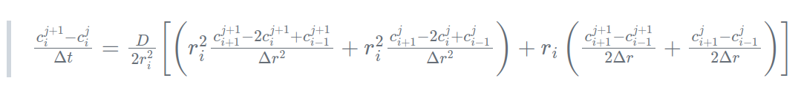
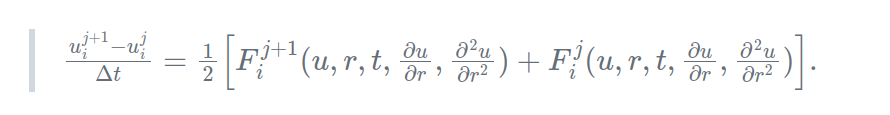

# Maths and Theory

A half single particle model by Group B for the 2023 PX915 group project.

## 1 Mathematics and Algorithms

A Crank-Nicolson semi-implicit finite difference scheme is used to approximate the partial differential equation (PDE) solution to obtain the concentration of lithium in the sphere, c(iapp, r), at each time step. This is accurate to second order both spatially and temporally, i.e. ($\Delta$ r2) & ($\Delta$ r2)

A key benefit of the Crank-Nicolson scheme is that it is unconditionally stable for the spherically symmetric diffusion equation (the PDE of interest), thus not restricting the user's choice of step size spatially or temporally. Although, due to being second order, the accuracy may be impacted by a larger step size.

The implicit nature of the Crank-Nicolson scheme makes it ideal for numerically approximating solutions to both stiff and highly nonlinear diffusion problems, providing the user a strong base from which to update this solution framework.

Additionally, the Crank-Nicolson scheme is consistent meaning that 'the error of the numerical method converges to zero as the grid spacing, or time step, reduces to zero from above, under certain regularity conditions on the solution.'

The consistency and stability of the Crank-Nicolson scheme means it satisfies the Lax equivalence theorem, which states that a numerical method is convergent if and only if it is both consistent and stable.

Specific Equation:

@image latex specific_eq.png

Generally:

@image latex general_eq.png

This is an average of standard forward and backward Euler methods.

Boundary conditions are treated through the use of ghost nodes, which assign values for the function of interest to regions just beyond the domain of the problem in an attempt to approximate the first derivatives present in the Neumann boundary conditions specified.