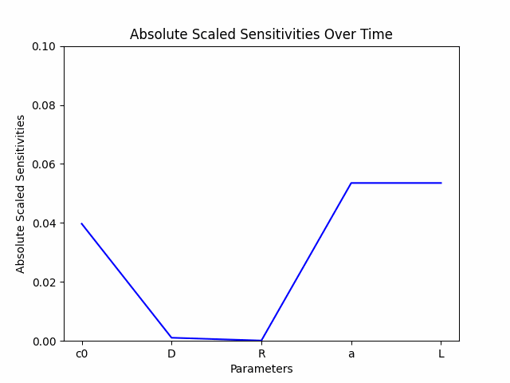
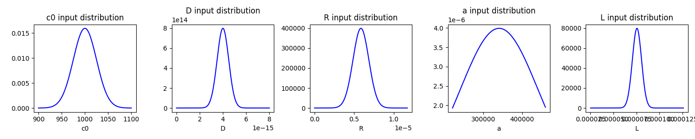
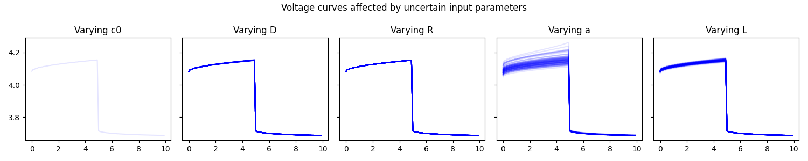

# Uncertainty Quantification

Below are the results of some uncertainty quantification that has been carried out for SPAMS.

## Sensitivity Analysis

First order sensitivity analysis.

## Uncertainty Propagation

Input Parameter Distributions

Resulting distribution of v(t)

